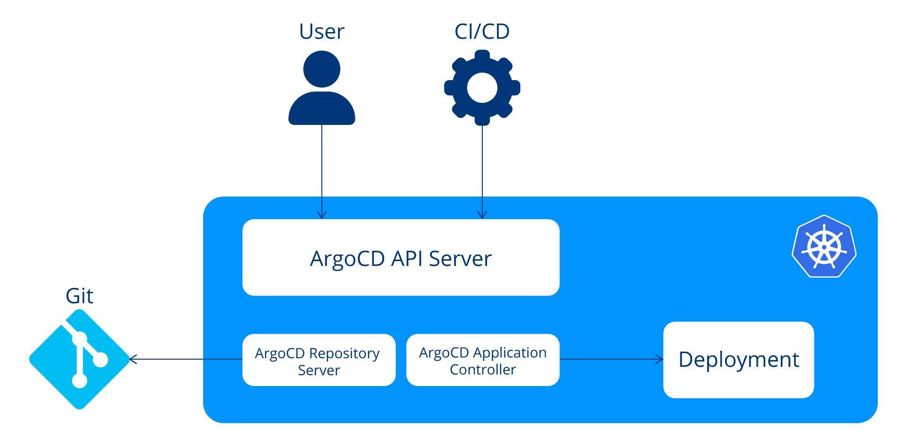

# Certified-Argo-Project-Associate-CAPA
Certified Argo Project Associate (CAPA)

# Introduction to Argo

## What Is GitOps?
- Backbone of modern Software delivery practice

### Five key aspects:
- Declarative configuration
- Immutable storage
- Automation
- Software agents
- Closed loop

## What Is Argo?
- Kubernetes-native tools with workflow management capabilities of Kubernetes.
- includes 
    - Argo Continuous Delivery (CD)
    - Argo Workflows for running complex jobs
    - Argo Events for event-based dependency management 
    - Argo Rollouts for progressive delivery

### Argo Continuous Delivery (CD)
- declarative, GitOps Continuous Delivery tool for Kubernetes

features:
- blue-green and canary update strategies
- integrates with service meshes
- ingress controllers to shape traffic
- automates promotion
- rollback based on analysis
- safely deploy artifacts into Production

### Argo Workflows
- A kind of ci tool same like jenkins

### Argo Events
- event-driven workflow automation framework
- helps you trigger Kubernetes objects, Argo Workflows, serverless workloads, and other processes in response to events from various sources such as webhooks, S3, schedules, messaging queues, GCP PubSub, and more. It supports events from over 20 event sources and allows you to customize business-level constraint logic for workflow automation.
- 2 components of argo workflow: Trigger and Event Sources.

### Argo rollouts
- progressive delivery controller
- born because k8s does not support deployment strategies by its own
- helps with
    - blue-green and canary update strategies
    - integrates with service meshes and ingress controllers to shape traffic
    - and automates promotion and rollback based on analysis

Quiz:

2.1 What is Argo’s role in Kubernetes workflow management?

a. Argo is a database management tool 
b. Argo provides version-controlled application deployment and workflow automation 
c. Argo is a containerization platform 
d. Argo is a networking solution for Kubernetes

Ans: b

2.2 What is the primary role of Kubernetes in the context of Argo’s functionalities?

a. Kubernetes is a version control system
b. Kubernetes provides essential infrastructure for container orchestration
c. Kubernetes is a continuous delivery tool
d. Kubernetes is a database management system

Ans: b

2.3 How does Argo align with modern development practices, ensuring a single source of truth for both code and infrastructure?

a. Utilizing Docker Compose files
b. Enforcing Microservices architecture
c. Removing outdated practices from Kubernetes
d. Following the principles of GitOps

Ans: D

## Argo CD
- declarative, GitOps continuous delivery tool

### Advancements
- GitOps
- Continuous Delivery
- Rollbacks
- Multi-environment management
- UI and API

### Vocabulary
- Configuration
    - Application
    - Application source type: helm/kustomize
- States
    - Target state
    - Live state
- Statuses
    - Sync status
    - Sync operation status
    - Health status 
- Actions
    - Sync
    - Refresh

### Core componmenmts
https://argo-cd.readthedocs.io/en/stable/operator-manual/architecture/

- controllers
- API Server
- Repository Server
- Application Controller

